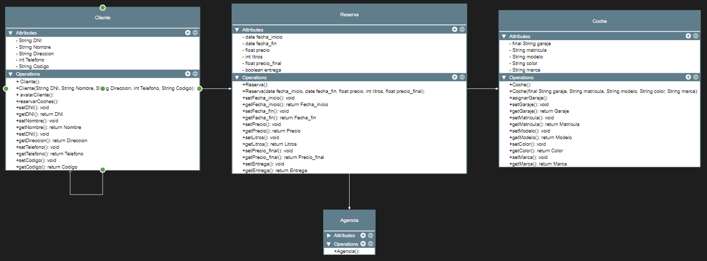

# SimulacroEntornos2
## ENUNCIADO
### Alquiler automóviles
Se desea diseñar un diagrama de clases sobre la información de las reservas de una empresa dedicada al alquiler de automóviles, teniendo en cuenta que:

Un determinado cliente puede tener un momento dado hechas varias reservas. De cada cliente se desea almacenar su DNI, nombre, dirección y teléfono. Además dos clientes se diferencian por un código único. Cada cliente puede ser avalado por otro cliente de la empresa. Una reserva la realiza un único cliente pero puede involucrar varios coches.
Es importante registrar la fecha de inicio y finaol de la reserva, el precio del alquiler de cada uno de los coches, los litros de gasolina en el depósito en el momento de realizar la reserva, el precio total de la reserva y un indicador de si el coche o los coches han sido entregados.
Todo coche tiene siempre asignado un determinado garaje que no puede cambiar. De cada coche se requiere la matrícula, el modelo, el color y la marca. Cada reserva se realiza en una determinada agencia.

## SOLUCIÓN

